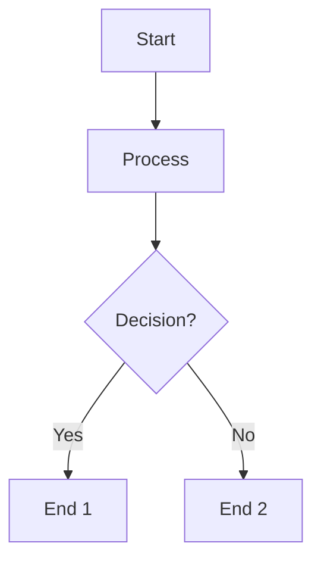
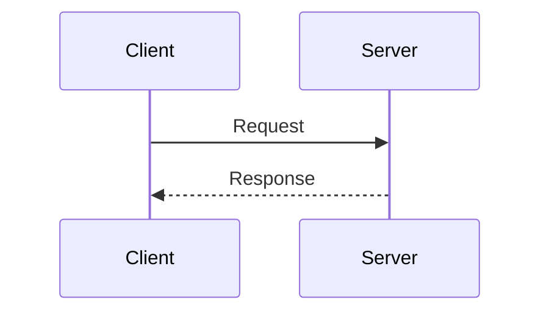
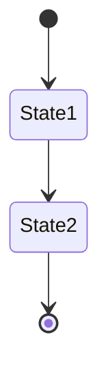

# Prompt Examples for Confluence Design Document Writer

This guide provides example prompts for using the `create_or_update_confluence_page` tool to generate and publish developer design documents to Confluence.

## Table of Contents

- [Basic Usage](#basic-usage)
- [Complete Workflow Examples](#complete-workflow-examples)
- [With Design Document Validation](#with-design-document-validation)
- [With Mermaid Diagrams](#with-mermaid-diagrams)
- [Updating Existing Pages](#updating-existing-pages)
- [Best Practices](#best-practices)

## Basic Usage

### Simple Design Document Creation

```
Use our MCP tools.

Create a design document for the new authentication feature and publish it to Confluence:

1. Expected Sections:
   - Overview (required)
   - Goals (required)
   - Non-Goals (optional)
   - Background (optional)
   - Architecture (required - must include diagram)
   - Data Flow (optional)
   - API Changes (optional)
   - Security Considerations (required)
   - Testing Strategy (required)
   - Rollout Plan (optional)
   - Open Questions (optional)

2. Analyze the codebase:
   - Focus on: authentication flows and related services @packages/backend/src/routes/v3/authentication.ts
   - Identify: service boundaries, API contracts, data flow

3. Generate document with:
   - Mermaid flowchart showing the authentication architecture
   - Mermaid sequence diagram for login and token refresh flows

   the mermaid example:
   ```flowchart TD
      A[Christmas] -->|Get money| B(Go shopping)
      B --> C{Let me think}
      C -->|One| D[Laptop]
      C -->|Two| E[iPhone]
      C -->|Three| F[fa:fa-car Car]```

4. Publish:
   create_or_update_confluence_page({
     space_id: "YOUR_SPACE_ID",
     title: "Design Doc: Authentication Feature",
     content: "[generated markdown with mermaid diagrams]",
     parent_page_id: "YOUR_PARENT_PAGE_ID",
     validate_design_doc: true
   })
```

### With Template Reference

```
Use our MCP tools.

Generate a design document for the payment processing feature using an existing template:

1. Read the design doc template:
   read_confluence_page({
     url: "https://company.atlassian.net/wiki/spaces/YOUR_SPACE/pages/YOUR_PAGE_ID/Design+Doc+Template"
   })

2. Analyze the codebase:
   - Focus on: payment processing services @packages/backend/src/routes/v3/payments.ts
   - Identify: key flows, external integrations, and failure modes

3. Generate document with:
   - Overview and detailed requirements
   - Architecture section with a Mermaid flowchart
   - Sequence diagram for the end-to-end payment flow

   the mermaid example:
   ```flowchart TD
      A[Christmas] -->|Get money| B(Go shopping)
      B --> C{Let me think}
      C -->|One| D[Laptop]
      C -->|Two| E[iPhone]
      C -->|Three| F[fa:fa-car Car]```

4. Publish:
   create_or_update_confluence_page({
     space_id: "YOUR_SPACE_ID",
     title: "Design Doc: Payment Processing",
     content: "[generated markdown content]",
     parent_page_id: "YOUR_PARENT_PAGE_ID",
     validate_design_doc: true
   })
```

## Complete Workflow Examples

### Example 1: Knowledge Management Microservices Migration

```
Use our MCP tools.

Create an architecture design document for the microservices migration project:

1. Expected Sections:
   - Overview (required)
   - Goals (required)
   - Non-Goals (optional)
   - Background (optional)
   - Architecture (required - must include diagram)
   - Data Flow (optional)
   - API Changes (optional)
   - Security Considerations (required)
   - Testing Strategy (required)
   - Rollout Plan (optional)
   - Open Questions (optional)

2. Analyze the codebase:
   - Focus on: knowledge management module and all of its functionality @packages/backend/src/routes/v3/knowledge-management.ts
   - Identify: service boundaries, API contracts, data flow

3. Generate document with:
   - Mermaid flowchart showing service architecture
   - Mermaid sequence diagram for inter-service communication

   the mermaid example:
   ```flowchart TD
      A[Christmas] -->|Get money| B(Go shopping)
      B --> C{Let me think}
      C -->|One| D[Laptop]
      C -->|Two| E[iPhone]
      C -->|Three| F[fa:fa-car Car]```

   - Component interaction diagrams

4. Publish:
   create_or_update_confluence_page({
     space_id: "YOUR_SPACE_ID",
     title: "Design Doc: Knowledge Management System Microservices Migration",
     content: "[generated markdown with mermaid diagrams]",
     parent_page_id: "YOUR_PARENT_PAGE_ID",
     validate_design_doc: true
   })
```

### Example 2: User Notification System Design

```
Use our MCP tools.

Create an architecture design document for the microservices migration project:

1. Expected Sections:
   - Overview (required)
   - Goals (required)
   - Non-Goals (optional)
   - Background (optional)
   - Architecture (required - must include diagram)
   - Data Flow (optional)
   - API Changes (optional)
   - Security Considerations (required)
   - Testing Strategy (required)
   - Rollout Plan (optional)
   - Open Questions (optional)

2. Analyze the codebase:
   - Focus on: notification services and message dispatch @packages/backend/src/routes/v3/notifications.ts
   - Identify: service boundaries, API contracts, data flow

3. Generate document with:
   - Mermaid flowchart showing service architecture
   - Mermaid sequence diagram for inter-service communication

   the mermaid example:
   ```flowchart TD
      A[Christmas] -->|Get money| B(Go shopping)
      B --> C{Let me think}
      C -->|One| D[Laptop]
      C -->|Two| E[iPhone]
      C -->|Three| F[fa:fa-car Car]```

   - Component interaction diagrams

4. Publish:
   create_or_update_confluence_page({
     space_id: "YOUR_SPACE_ID",
     title: "Design Doc: User Notification System",
     content: "[generated markdown with mermaid diagrams]",
     parent_page_id: "YOUR_PARENT_PAGE_ID",
     validate_design_doc: true
   })
```

## With Design Document Validation

### Using Guardrails

When `validate_design_doc: true`, the tool automatically:
- Validates all required sections are present and non-empty
- Adds architecture diagram placeholders if missing
- Marks empty sections as "Not applicable" with explanations
- Reorders sections to canonical structure

```
Generate a design document for the API rate limiting feature with validation enabled:

Use our MCP tools to:

1. Analyze the gateway and rate limiting logic in:
   - @packages/backend/src/routes/v3/gateway.ts
   - @packages/backend/src/services/rate-limiter.ts

2. Generate a design doc including:
   - Overview and goals for rate limiting
   - Architecture section with a Mermaid diagram of request flow and quota enforcement
   - Security considerations around abuse prevention and denial-of-service

3. Publish:
   create_or_update_confluence_page({
     space_id: "YOUR_SPACE_ID",
     title: "Design Doc: API Rate Limiting",
     content: "# Overview\n...\n## Architecture\n...",
     validate_design_doc: true
   })
```

**Expected Sections (when validation is enabled):**
1. Overview (required)
2. Goals (required)
3. Non-Goals (optional)
4. Background (optional)
5. Architecture (required - must include diagram)
6. Data Flow (optional)
7. API Changes (optional)
8. Security Considerations (required)
9. Testing Strategy (required)
10. Rollout Plan (optional)
11. Open Questions (optional)

## With Mermaid Diagrams

### Architecture Flowchart

```
Create a design document with an architecture diagram:

create_or_update_confluence_page({
  space_id: "ENG",
  title: "Design Doc: Event Sourcing System",
  content: `# Overview
This document describes the event sourcing architecture.

## Architecture

\`\`\`mermaid
flowchart TD
    Client[Client Application] --> API[API Gateway]
    API --> EventStore[Event Store]
    EventStore --> ReadModel[Read Model]
    EventStore --> Projection[Projection Service]
    Projection --> ReadModel
    ReadModel --> QueryAPI[Query API]
    Client --> QueryAPI
\`\`\`
`,
  validate_design_doc: true
})
```

### Sequence Diagram

```
Generate a design doc with a sequence diagram showing the authentication flow:

create_or_update_confluence_page({
  space_id: "ENG",
  title: "Design Doc: OAuth2 Authentication",
  content: `## Authentication Flow

\`\`\`mermaid
sequenceDiagram
    participant User
    participant Client
    participant AuthServer
    participant ResourceServer
    
    User->>Client: Login Request
    Client->>AuthServer: Authorization Request
    AuthServer->>User: Login Form
    User->>AuthServer: Credentials
    AuthServer->>Client: Authorization Code
    Client->>AuthServer: Exchange Code for Token
    AuthServer->>Client: Access Token
    Client->>ResourceServer: API Request with Token
    ResourceServer->>Client: Protected Resource
\`\`\`
`,
  validate_design_doc: true
})
```

### Multiple Diagrams

```
Create a design document with multiple diagrams:

create_or_update_confluence_page({
  space_id: "ENG",
  title: "Design Doc: Distributed Caching System",
  content: `# Overview
...

## System Architecture

\`\`\`mermaid
flowchart LR
    App[Application] --> Cache[Cache Cluster]
    Cache --> Redis[(Redis)]
    Cache --> Memcached[(Memcached)]
\`\`\`

## Cache Update Flow

\`\`\`mermaid
sequenceDiagram
    participant App
    participant Cache
    participant DB
    
    App->>Cache: Check Cache
    Cache-->>App: Cache Miss
    App->>DB: Query Database
    DB-->>App: Data
    App->>Cache: Update Cache
\`\`\`
`,
  validate_design_doc: true
})
```

## Updating Existing Pages

### Update by Page ID

```
Update an existing design document:

create_or_update_confluence_page({
  space_id: "YOUR_SPACE_ID",
  title: "Design Doc: Feature X (Updated)",
  content: "[updated markdown content]",
  page_id: "YOUR_PAGE_ID",
  validate_design_doc: true
})
```

### Update by Title (Auto-detect)

```
Update a design document by searching for the title:

create_or_update_confluence_page({
  space_id: "YOUR_SPACE_ID",
  title: "Design Doc: Feature X",
  content: "[updated content]",
  validate_design_doc: true
})
```

The tool will automatically:
- Search for a page with the same title in the space
- Update it if found, or create a new one if not found

## Best Practices

### 1. Always Use Validation for Design Docs

```
create_or_update_confluence_page({
  ...
  validate_design_doc: true  // Always enable for design documents
})
```

### 2. Include Mermaid Diagrams

Always include at least one diagram in the Architecture section:
- Flowcharts for system architecture
- Sequence diagrams for process flows
- State diagrams for state machines

### 3. Organize with Parent Pages

```
parent_page_id: "YOUR_PARENT_PAGE_ID"  // Organize under a parent page
```

### 4. Complete Workflow Template

```
Generate and publish a design document for [FEATURE]:

1. **Read Template & Examples**
   - Template: read_confluence_page({ url: "[TEMPLATE_URL]" })
   - Example: read_confluence_page({ url: "[EXAMPLE_URL]" })

2. **Analyze Codebase**
   - Focus on: [DIRECTORIES/FILES]
   - Identify: [KEY_PATTERNS/FLOWS]

3. **Generate Document**
   - Include Mermaid diagrams for:
     * System architecture (flowchart)
     * Data flow (sequence diagram)
     * Component interactions (if applicable)
   - Ensure all sections are complete

4. **Publish to Confluence**
   create_or_update_confluence_page({
     space_id: "YOUR_SPACE_ID",
     title: "Design Doc: [FEATURE_NAME]",
     content: "[GENERATED_MARKDOWN]",
     parent_page_id: "YOUR_PARENT_PAGE_ID",
     validate_design_doc: true
   })
```

## Tool Parameters Reference

| Parameter | Type | Required | Description |
|-----------|------|----------|-------------|
| `space_id` | string | Yes | Confluence space ID (e.g., "ENG" or numeric ID) |
| `title` | string | Yes | Page title |
| `content` | string | Yes | Markdown content (can include Mermaid diagrams) |
| `parent_page_id` | string | No | Parent page ID for hierarchy |
| `page_id` | string | No | Specific page ID to update (if not provided, searches by title) |
| `validate_design_doc` | boolean | No | Enable design document guardrails (default: false) |

## Mermaid Diagram Syntax

### Flowchart Example
````markdown

````

### Sequence Diagram Example
````markdown

````

### State Diagram Example
````markdown

````

## Troubleshooting

### Tool Not Appearing in Cursor

1. **Restart Cursor** completely
2. **Toggle MCP Server** in Cursor Settings → MCP Servers
3. **Check MCP Config** at `~/.cursor/mcp.json`
4. **Verify Build** - ensure `npm run build` completed successfully

### Diagrams Not Rendering

- Ensure Mermaid code blocks use triple backticks with `mermaid` language
- Check that `@mermaid-js/mermaid-cli` is installed
- Verify the diagram syntax is valid Mermaid

### Validation Errors

- Check that all required sections are present
- Ensure Architecture section includes a diagram
- Review error messages for specific missing content

## Additional Resources

- [Mermaid Documentation](https://mermaid.js.org/)
- [Confluence Storage Format](https://confluence.atlassian.com/doc/confluence-storage-format-790796544.html)
- [Atlassian REST API](https://developer.atlassian.com/cloud/confluence/rest/)

