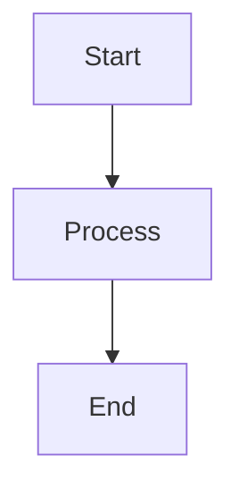

# Jira & Confluence MCP Server

A TypeScript MCP server that enables Cursor to read Jira tickets and Confluence pages, converting them to markdown and breaking them into actionable plans.

## Features

| Tool                               | Description                                                                                                         |
| ---------------------------------- | ------------------------------------------------------------------------------------------------------------------- |
| `read_jira_ticket`                 | Fetches Jira issue details (summary, status, assignee, subtasks, description) and returns markdown                  |
| `read_confluence_page`             | Fetches Confluence page content and returns markdown                                                                |
| `read_confluence_page_comments`    | Fetches all comments (footer/inline) from a Confluence page                                                         |
| `read_confluence_image`            | Downloads and returns an image attachment from a Confluence page as base64 for visual inspection                    |
| `breakdown_to_plan`                | Transforms Jira/Confluence content into structured actionable tasks                                                 |
| `create_or_update_confluence_page` | Creates or updates Confluence pages with Markdown content, renders Mermaid diagrams, and validates design documents |

## Prerequisites

- Node.js 18+ (uses built-in `fetch`)
- Atlassian Cloud account with:
  - Email address
  - [API token](https://id.atlassian.com/manage-profile/security/api-tokens)
  - Base URL (e.g., `https://yourcompany.atlassian.net`)

## Setup

### 1. Install dependencies

```bash
npm install
```

### 2. Configure environment

Create a `.env` file in the project root:

```env
ATLASSIAN_EMAIL=your-email@company.com
ATLASSIAN_API_TOKEN=your-api-token
ATLASSIAN_BASE_URL=https://yourcompany.atlassian.net
```

### 3. Build

```bash
npm run build
```

### 4. Run (stdio MCP)

```bash
npm start
```

You should see: `MCP server ready (stdio)`.

## Cursor Configuration

Add the following to `~/.cursor/mcp.json`:

### Option 1: Inline environment variables

```json
{
  "mcpServers": {
    "jira-confluence": {
      "command": "node",
      "args": ["/path/to/confluence-mcp-server/dist/index.js"],
      "env": {
        "ATLASSIAN_EMAIL": "your-email@company.com",
        "ATLASSIAN_API_TOKEN": "your-api-token",
        "ATLASSIAN_BASE_URL": "https://yourcompany.atlassian.net"
      }
    }
  }
}
```

### Option 2: Using `.env` file

If you prefer to keep credentials in a `.env` file (created during setup), you can omit the `env` block. The server automatically loads `.env` from the project root:

```json
{
  "mcpServers": {
    "jira-confluence": {
      "command": "node",
      "args": ["/path/to/confluence-mcp-server/dist/index.js"]
    }
  }
}
```

Make sure your `.env` file exists in the project root with:

```env
ATLASSIAN_EMAIL=your-email@company.com
ATLASSIAN_API_TOKEN=your-api-token
ATLASSIAN_BASE_URL=https://yourcompany.atlassian.net
```

> **Note:** Replace `/path/to/confluence-mcp-server` with the actual path to this project. Environment variables in `mcp.json` take precedence over `.env` if both are provided.

## Tool Usage

### read_jira_ticket

Accepts either a URL or issue key:

```
url: "https://yourcompany.atlassian.net/browse/PROJ-123"
```

or

```
ticket_key: "PROJ-123"
```

### read_confluence_page

Accepts either a URL or page ID:

```
url: "https://yourcompany.atlassian.net/wiki/spaces/SPACE/pages/123456/Page+Title"
```

or

```
page_id: "123456"
```

**Confluence Macro Support:**

The tool properly parses and converts Confluence-specific macros to markdown:

- **Code blocks** — Rendered as fenced code blocks with language syntax highlighting
- **Expand/collapse sections** — Converted to `<details>/<summary>` HTML
- **Info/Note/Warning/Tip panels** — Converted to blockquotes with labels
- **Image attachments** — Full download URLs with captions rendered as italic text
- **Internal links** — Preserved as clickable links
- **TOC macro** — Stripped (not useful in markdown)

### read_confluence_page_comments

Fetches all footer and inline comments (with nested replies) from a Confluence page:

```
url: "https://yourcompany.atlassian.net/wiki/spaces/SPACE/pages/123456/Page+Title"
```

or

```
page_id: "123456"
```

### read_confluence_image

Downloads and returns an image attachment from a Confluence page. Returns the image as base64 so it can be viewed directly by the AI. Useful for inspecting architecture diagrams, flowcharts, or any embedded images.

```
url: "https://yourcompany.atlassian.net/wiki/download/attachments/123456/image.png"
```

or

```
page_id: "123456"
filename: "image-20260415-222345.png"
```

### breakdown_to_plan

Pass fetched content to generate a structured plan:

```
content: "<content from Jira or Confluence>"
format: "text" | "markdown"
```

### create_or_update_confluence_page

Creates or updates a Confluence page with Markdown content:

```
space_id: "YOUR_SPACE_ID" (required - e.g., "ENG" or numeric ID)
title: "Design Doc: Feature X" (required)
content: "# Markdown content..." (required)
parent_page_id: "YOUR_PARENT_PAGE_ID" (optional)
page_id: "YOUR_PAGE_ID" (optional - to update specific page)
validate_design_doc: true (optional - enables design doc guardrails)
```

**Features:**

- Converts Markdown to Confluence Storage Format (XHTML)
- Renders Mermaid diagrams to SVG and attaches them to the page
- Displays Mermaid code blocks and embedded SVG images on the page
- Validates design documents with guardrails (section validation, diagram placeholders, etc.)

**Mermaid Diagrams:**
Include Mermaid diagrams in your markdown using code blocks. The tool will:

1. Display the Mermaid code in a code block on the page
2. Render the diagram to SVG using mermaid-cli
3. Upload the SVG as an attachment to the page
4. Embed the rendered image below the code block

Example:

````markdown

````

For detailed prompt examples and usage patterns, see [PROMPT_EXAMPLES.md](./PROMPT_EXAMPLES.md).

## Scripts

| Command                    | Description                             |
| -------------------------- | --------------------------------------- |
| `npm run build`            | Compile TypeScript to `dist/`           |
| `npm start`                | Run the compiled MCP server             |
| `npm run dev`              | Run directly with ts-node (development) |
| `npm run test:connections` | Test Atlassian API connectivity         |

## Notes

- All three environment variables are required; missing values will fail startup.
- Server uses stdio transport only; no HTTP port is opened.
- Content is converted from Atlassian storage format to markdown using [Turndown](https://github.com/mixmark-io/turndown) with custom pre-processing for Confluence macros (code blocks, expand sections, panels, images with captions).
- Image attachments are served with full authenticated download URLs. Use `read_confluence_image` to download and view them directly.
