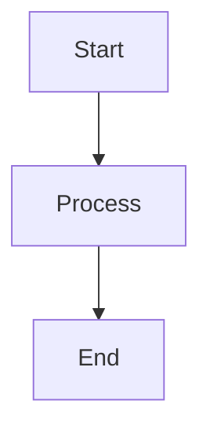

# @rexymayderio/jira-confluence-mcp

A TypeScript MCP server for reading Jira tickets, Confluence pages, and publishing content back to Confluence — with Mermaid diagram rendering and design doc validation.

## Quick Start

```bash
npx -y @rexymayderio/jira-confluence-mcp
```

No clone or install needed. Just add it to your MCP client config.

## MCP Client Configuration

Add to your MCP settings (Kiro, Cursor, Claude Desktop, etc.):

```json
{
  "mcpServers": {
    "jira-confluence": {
      "command": "npx",
      "args": ["-y", "@rexymayderio/jira-confluence-mcp"],
      "env": {
        "ATLASSIAN_EMAIL": "your-email@company.com",
        "ATLASSIAN_API_TOKEN": "your-api-token",
        "ATLASSIAN_BASE_URL": "https://yourcompany.atlassian.net"
      }
    }
  }
}
```

All three environment variables are required. Get your API token from [Atlassian API Tokens](https://id.atlassian.com/manage-profile/security/api-tokens).

## Tools

| Tool                               | Description                                                                                        |
| ---------------------------------- | -------------------------------------------------------------------------------------------------- |
| `read_jira_ticket`                 | Fetches Jira issue details (summary, status, assignee, subtasks, description) and returns markdown |
| `read_confluence_page`             | Fetches Confluence page content and returns markdown                                               |
| `read_confluence_page_comments`    | Fetches all comments (footer/inline) from a Confluence page                                        |
| `read_confluence_image`            | Downloads and returns an image attachment from a Confluence page as base64                         |
| `breakdown_to_plan`                | Transforms Jira/Confluence content into structured actionable tasks                                |
| `create_or_update_confluence_page` | Creates or updates Confluence pages with Markdown, renders Mermaid diagrams, validates design docs |

## Tool Usage

### read_jira_ticket

Accepts either a URL or issue key:

```json
{ "url": "https://yourcompany.atlassian.net/browse/PROJ-123" }
```

```json
{ "ticket_key": "PROJ-123" }
```

### read_confluence_page

Accepts either a URL or page ID:

```json
{
  "url": "https://yourcompany.atlassian.net/wiki/spaces/SPACE/pages/123456/Page+Title"
}
```

```json
{ "page_id": "123456" }
```

**Confluence Macro Support:**

- **Code blocks** — Fenced code blocks with language syntax highlighting
- **Expand/collapse** — Converted to `<details>/<summary>` HTML
- **Info/Note/Warning/Tip panels** — Blockquotes with labels
- **Image attachments** — Full download URLs with captions
- **Internal links** — Preserved as clickable links

### read_confluence_page_comments

```json
{ "page_id": "123456" }
```

### read_confluence_image

Downloads and returns an image attachment as base64 for visual inspection (architecture diagrams, flowcharts, etc.).

```json
{
  "url": "https://yourcompany.atlassian.net/wiki/download/attachments/123456/image.png"
}
```

```json
{ "page_id": "123456", "filename": "image-20260415-222345.png" }
```

### breakdown_to_plan

```json
{ "content": "<content from Jira or Confluence>", "format": "markdown" }
```

### create_or_update_confluence_page

```json
{
  "space_id": "ENG",
  "title": "Design Doc: Feature X",
  "content": "# Markdown content...",
  "parent_page_id": "123456",
  "page_id": "789012",
  "validate_design_doc": true,
  "labels": ["design-doc", "feature-x"]
}
```

**Features:**

- Converts Markdown to Confluence Storage Format (XHTML)
- Renders Mermaid diagrams to SVG and attaches them to the page
- Validates design documents with guardrails (section validation, diagram placeholders, heading ordering)

**Mermaid Diagrams:**

Include Mermaid diagrams in your markdown using fenced code blocks. The tool will render them to SVG, upload as attachments, and embed inline.

````markdown

````

## Development

```bash
git clone <repo-url>
cd confluence-mcp-server
npm install
npm run build
npm start
```

| Command         | Description                              |
| --------------- | ---------------------------------------- |
| `npm run build` | Compile TypeScript to `dist/` + chmod +x |
| `npm start`     | Run the compiled MCP server              |
| `npm run dev`   | Watch mode (tsc --watch)                 |

## Requirements

- Node.js 18+ (uses built-in `fetch`)
- Atlassian Cloud account with API token

## Notes

- Server uses stdio transport — no HTTP port is opened.
- Content is converted from Atlassian storage format to markdown using [Turndown](https://github.com/mixmark-io/turndown) with custom Confluence macro handling.
- For detailed prompt examples, see [PROMPT_EXAMPLES.md](./PROMPT_EXAMPLES.md).
